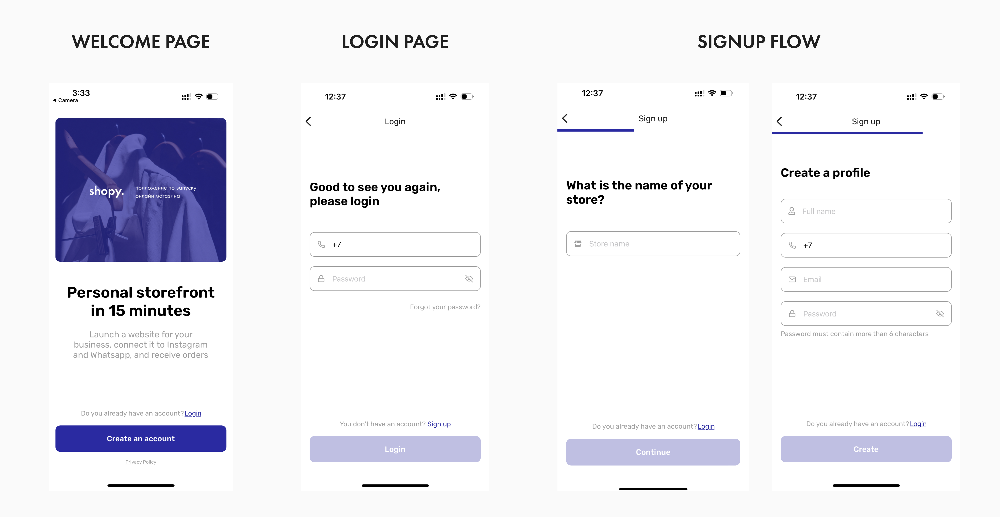

# Shopy - Your Personal Storefront Builder

Shopy is a full stack mobile CMS designed to empower small business owners in Kazakhstan who sell through Instagram, WhatsApp, and TikTok. With Shopy, you can launch your own personalized online store in just 15 minutes. Elevate your sales, enhance your catalog, and harness the power of built-in analytics to identify top-performing products.

## Key Features

### 1. Authentication

Seamless authentication powered by Firebase Authentication. Use your email or phone number to log in and access your store dashboard.

### 2. My Website

Create a unique online presence with ease:

- Choose a subdomain for your store, e.g., `https://my-store.shopy.ws`
- Add essential store details: name, address, working hours, and contact information
- Personalize your store's design: pick a logo, background banner, and accent color using the color wheel
- Share external links to social media profiles and more

### 3. Catalog

Effortlessly manage your products and categories:

- **Create Categories**: Organize your products by creating custom categories to help customers navigate your offerings.

- **Showcase Products**: Display all your products in one centralized catalog for easy browsing.

- **Add New Products**: Intuitively add new products to your store with images, descriptions, and pricing details.

- **Define Options**: Customize products with various options like size, color, and material, giving your customers more choices.

- **Control Availability**: Manage product availability and choose whether to display items on your website.

- **Discounts Made Easy**: Set up automatic percent-based discounts to boost sales effortlessly.

### 4. Profile

Easily manage your profile information:

- Update your personal and store-related details

## Technologies and Stack

Shopy is built using the following technologies:

- **React Native**: A popular JavaScript framework for building native mobile apps.
- **Expo Development Build**: A set of tools and services for developing and deploying React Native applications more easily.
- **Firebase Functions**: Serverless functions from Firebase that provide backend functionality to your app.

## Installation

1. Clone the repository: `git clone https://github.com/yourusername/shopy.git`
2. Navigate to the project directory: `cd shopy`
3. Install dependencies: `npm install`

## Usage

1. Follow the installation steps
2. Run the app: `npm start`

## Contributing

We welcome contributions! If you have ideas or suggestions, feel free to open an issue or submit a pull request.

## Contact

For any inquiries or support, reach out to us at contact@shopy.ws.

## License

This project is licensed under the [MIT License](LICENSE).
